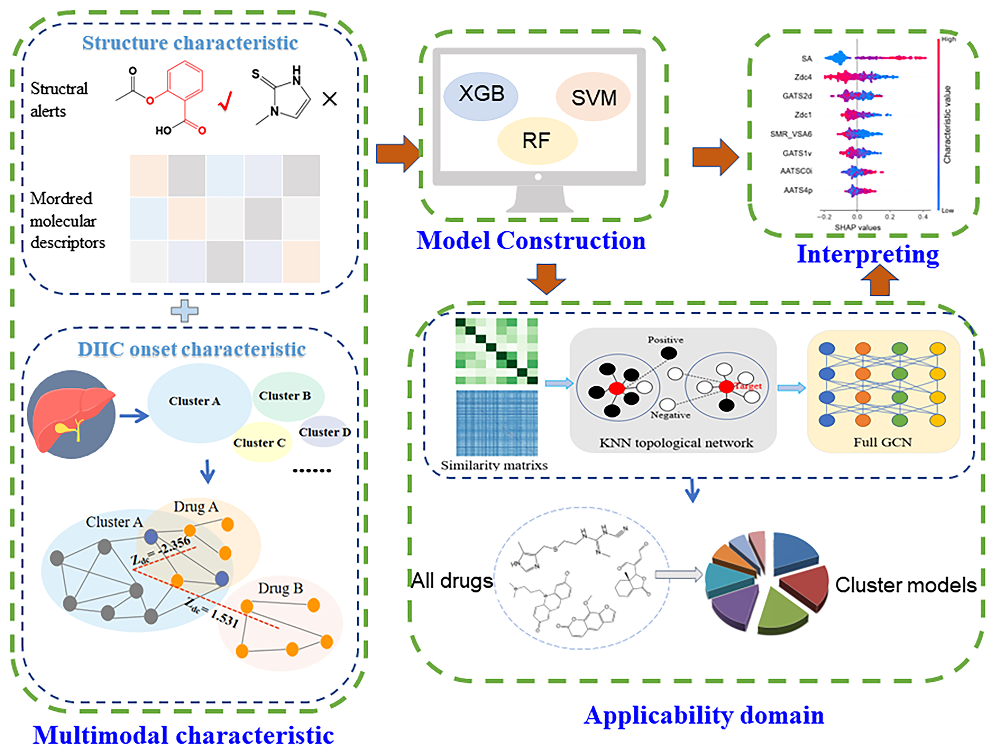

# cluster_multimodal_models

Multimodal modeling based on molecular structure and the relationship between the drug and the disease onset, further explored by disease gene clustering combined with KNN-GCN (K-Nearest Neighbors-Graph Convolutional Network) classifying drugs, was applied to predict drug-induced intrahepatic cholestasis (DIIC) as one main aspect of hepatotoxicity.  

## Descriptions of the files
- preprocess_VT: deleting the Mordred descriptors with standard deviations less than 0.10, input file is ‘mordred.csv’.
- preprocess_pearson: deleting the Mordred descriptors with Pearson correlation coefficients greater than 0.90.  
- louvain_cluster: identifying gene clusters by louvain algorithm, input file is ‘disease_gene_network.txt’.
- network_proximity: calculating the relative average shortest distance between the drug targets and disease onset clusters, input files are ‘drug_target.txt’ and ‘cluster1-8.txt’ in ‘cluster_genes.zip’.
- process_RFE: screening the multimodal characteristics with the best 10-fold accuracy, input file is ‘multimodal_features.csv’.  
- machine_learning: SVM, RF, XGB modeling methods, input data are in ‘modeling_data.csv’ file.
- preprocess_data: preprocess the files of compounds and clusters before KNN-GCN.
- construct_graph: KNN constructs the topological network.
- predict_results: GCN predicts the associations between compounds and clusters.
  

